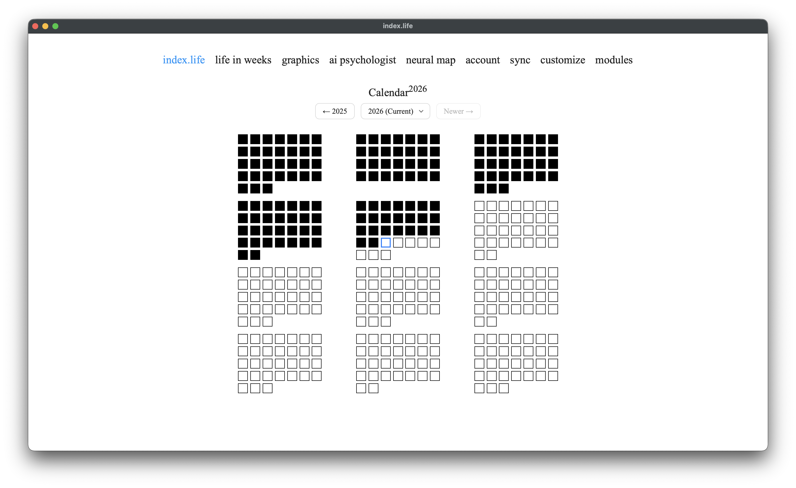

# index.life — Локальное приложение для ведения учёта настроения и заметок о днях

> **Русская версия** | [English version](README.en.md)

Помогает лучше помнить и осознавать себя и своё время.




> **Полная документация:** [docs/](docs/README.md) — приложение и база, синхронизация, модули, AI-психолог, нейронная карта, каждый график, кастомизация.

---

## О проекте

**index.life** — приложение для отслеживания настроения и ведения заметок о
днях. Он призван помочь человеку лучше помнить и осознавать себя и своё время,
которое иначе сливается в один неразличимый поток дней.

В основе простая ежедневная практика: каждый день остановиться на минуту и
записать, как прошёл день, что ты чувствовал и о чём думал. Я убеждён, что
превращение такой рефлексии в привычку положительно влияет на жизнь человека.

**Для чего нужен index.life:**

- **Привычка ежедневной рефлексии** — мягко побуждать писать о своём
  самочувствии и о своём дне каждый день.
- **Архив самочувствия и мыслей** — сохранять записи и оценки настроения
  надолго, чтобы потом возвращаться к ним: перечитывать, замечать динамику,
  вспоминать важное.
- **Понимание себя через свои данные** — превращать накопленные записи в
  наблюдения о настроении и о темах, людях и занятиях, которые на него влияют.
- **Приватность и владение своими данными** — дневник личный, поэтому
  index.life работает целиком локально и офлайн: без аккаунтов, серверов и
  телеметрии, и данные никогда не покидают твоё устройство. Твои данные принадлежат только тебе.

## Что внутри

Основа index.life — **календарь заметок** (весь год в виде тепловой карты,
которая мотивирует не пропускать дни), **markdown-редактор** для записей,
страница **«жизнь в неделях»**, **экспорт** в Markdown и **синхронизация** между
устройствами через твою облачную папку.

Чтобы помочь разобраться в написанном, index.life добавляет четыре опциональных
модуля:

1. **AI-психолог** — чат с локальной языковой моделью, у которой есть доступ к
   дневнику: она отражает написанное, замечает паттерны и опирается в ответах на
   твои реальные записи. [Подробнее »](docs/ru/ai-psychologist.md)
2. **Нейронная карта мыслей** — твои записи, собранные в темы, которые можно
   исследовать визуально. [Подробнее »](docs/ru/neural-map.md)
3. **Графики** — визуализация разных аспектов самочувствия во времени.
   [Подробнее »](docs/ru/graphics.md)
4. **Кастомизация** — настрой внешний вид всего приложения под себя.
   [Подробнее »](docs/ru/customization.md)

AI-психолог и нейронная карта подключаются по желанию (один раз скачивается
локальная модель); графики и кастомизация включаются прямо в приложении.

---

## Установка

### Вариант 1: Готовые сборки (рекомендуется)

Скачайте готовую версию для вашей операционной системы из Releases:

**Windows:**
1. Скачайте `windows-build.zip`
2. Распакуйте архив
3. Запустите `index-life.exe`

> **Первый запуск — «Система Windows защитила ваш компьютер» (SmartScreen)**
> index.life — бесплатное приложение с открытым кодом, поэтому `.exe` не
> подписан платным сертификатом, и при первом запуске Windows SmartScreen
> показывает синее окно с «Неизвестный издатель». Запускать безопасно —
> чтобы продолжить:
> 1. Нажмите **Подробнее** в окне предупреждения.
> 2. Нажмите **Выполнить в любом случае**.
>
> Это нужно сделать один раз для каждой версии. Если предупреждение появляется
> снова — ПКМ по скачанному `.zip` → **Свойства** → галочка **Разблокировать**
> → **ОК**, затем распакуйте архив заново.

**macOS:**
1. Скачайте `index-life_macos.dmg`
2. Откройте DMG и перетащите **index.life** в папку Applications
3. **Первый запуск.** Дважды кликните по index.life. macOS покажет окно
   *«Не удалось проверить, что приложение не содержит вредоносных программ…»* с
   двумя кнопками — нажмите **Done** (НЕ нажимайте «Переместить в корзину»).
4. Откройте **Системные настройки → Конфиденциальность и безопасность**,
   пролистайте вниз до раздела **Безопасность**. Там будет надпись
   *«Приложение "index.life" заблокировано…»* — нажмите **Open Anyway
   (Открыть всё равно)**, затем подтвердите кнопкой **Открыть** (Touch ID /
   пароль, если попросят).
5. index.life откроется — и дальше будет открываться обычным двойным кликом.

> **Почему так (и в Windows, и в macOS)?** index.life бесплатный и с открытым
> кодом, поэтому приложение не подписано платным сертификатом разработчика
> (Apple Developer — $99/год, сертификат для Windows тоже платный). Поэтому обе
> системы один раз показывают предупреждение для скачанных из интернета
> программ без платной подписи. Приложение безопасно и работает целиком на
> твоём устройстве — эти шаги просто один раз говорят системе, что ты ему
> доверяешь.
>
> *Альтернатива (Терминал):* `xattr -d com.apple.quarantine /Applications/index.life.app`

**Linux:**
1. Скачайте `index-life_linux_x86_64.AppImage`
2. Сделайте файл исполняемым:
   ```bash
   chmod +x index-life_linux_x86_64.AppImage
   ```
3. Запустите:
   ```bash
   ./index-life_linux_x86_64.AppImage
   ```

**Опциональные модули.** Устанавливаются прямо в приложении: откройте страницу
**Модули** и нажмите «Установить» у нужного модуля — это основной способ на всех
ОС, прогресс виден прямо в окне. После установки тяжёлого модуля (AI-психолог
или нейронная карта — один раз скачивается локальная модель) перезапустите
приложение. Подробнее — [docs/ru/modules.md](docs/ru/modules.md).

### Вариант 2: Установка через скрипты (с исходным кодом)

Если вы хотите запускать из исходников:

**Windows:**
```bash
# Двойной клик на install.bat (первый запуск)
# Двойной клик на start.bat (последующие запуски)
```

**Linux/macOS:**
```bash
chmod +x install.sh start.sh
./install.sh  # Первый запуск (установит Python при необходимости)
./start.sh    # Последующие запуски
```

**Опциональные модули.** Так же — через страницу **Модули** в приложении. Для
установки из исходников можно использовать и скрипт `install_modules.bat` /
`install_modules.sh`. Подробности — в `MODULES.md`.

---

## Обновление

index.life хранит данные **отдельно от самого приложения**, поэтому обновление
сводится к замене бинарника — дневник, AI-модели и настройки остаются на месте.

**Где лежат твои данные:**

| ОС | Папка с данными |
|---|---|
| **Windows** | рядом с `index-life.exe` (портативно); у старых пользователей — `%APPDATA%\index.life` (приложение найдёт само) |
| **macOS** | `~/Library/Application Support/index.life` |
| **Linux** | `~/.index-life` |

Внутри: `diary.db` (главный файл базы), `models/` (скачанные AI-модели),
`modules_venv/` (окружение модулей), `profile_photos/`, `backups/`,
`customization_uploads/` и файлы-маркеры `*_enabled`.

### Как обновляться

**macOS:**
1. Скачайте новый `.dmg` из Releases.
2. Откройте DMG и перетащите `index.life` в `Applications` **поверх** старого,
   подтвердите замену. Данные живут отдельно от `.app`, перекладывать ничего не
   нужно.
3. Откройте приложение. (macOS заново покажет окно безопасности при первом
   запуске — порядок действий тот же, что при установке.)

**Windows:**
1. Скачайте новый `windows-build.zip`.
2. **Простой путь:** распакуйте архив **поверх** существующей папки приложения,
   разрешите замену файлов. Zip содержит только `index-life.exe`, DLL и ассеты
   сборки — твои `diary.db`, `models/`, `modules_venv/` и остальные подпапки
   данных не пострадают.
3. **Аккуратный путь:** распакуйте в **новую** папку рядом со старой, затем
   перенесите из старой папки следующие файлы и подпапки: `diary.db`,
   `diary.db-wal`, `diary.db-shm`, `models/`, `modules_venv/`, `profile_photos/`,
   `backups/`, `customization_uploads/` и все файлы вида `*_enabled`. Запустите
   `index-life.exe` из новой папки.

**Linux (AppImage):**
1. Скачайте новый `index-life_linux_x86_64.AppImage`.
2. Замените им старый файл, сделайте исполняемым:
   `chmod +x index-life_linux_x86_64.AppImage`
3. Запустите. Данные в `~/.index-life` сохранены.

**Из исходников (любая ОС):**
```bash
git pull
./install.sh        # обновит зависимости (install.bat на Windows)
./start.sh          # обычный запуск
```
Папка проекта одновременно служит папкой данных, поэтому всё на месте.

### Что приложение делает само

- **Автоматический бэкап** базы при каждом запуске (последние 10 копий в
  подпапке `backups/`) — даже если что-то пойдёт не так, есть к чему откатиться.
- **Миграции схемы** запускаются при первом старте новой версии. Они
  идемпотентные и только добавляют поля/таблицы — ничего не удаляют.
- Если у тебя установлены опциональные модули и в новой версии **изменилась
  минорная версия Python**, приложение попросит переустановить модули.
  Скачанная AI-модель (~5 ГБ в `models/`) **сохраняется** — повторно качать её
  не придётся.

### Ручной бэкап на всякий случай

Чтобы подстраховаться, перед обновлением можно скопировать `diary.db` (а также
`diary.db-wal` и `diary.db-shm`, если они есть) в надёжное место. Этого
достаточно, чтобы вернуть дневник в любое прежнее состояние.

---

## Структура проекта

```
index-life-local/
├─ app/
│  ├─ modules/            # Опциональные модули (assistant и др.)
│  ├─ templates/          # HTML шаблоны
│  └─ static/             # Статические файлы (CSS, JS, изображения)
├─ tools/                 # Вспомогательные скрипты (установщик модулей)
├─ config.py              # Конфигурация
├─ run.py                 # Точка входа
├─ requirements.txt       # Зависимости Python
├─ install.bat/.sh        # Установка
├─ start.bat/.sh          # Запуск
├─ install_modules.bat/.sh# Установщик модулей
├─ MODULES.md             # Гайд по модулям
└─ diary.db               # База данных SQLite (создаётся при первом запуске)
```

---

## Технологии

- **Backend**: Flask 3.0.0
- **База данных**: SQLite (через Flask-SQLAlchemy)
- **Frontend**: HTML, CSS, Vanilla JavaScript
- **Изображения**: Pillow (Python Imaging Library)
- **Опционально**: llama-cpp-python, sentence-transformers

---

## Частые вопросы

**Где хранятся мои данные?**
В файле `diary.db` в директории приложения. Для резервного копирования просто скопируйте этот файл.

**Можно ли использовать на нескольких устройствах?**
Да — встроенная синхронизация держит актуальную версию дневника на всех устройствах через общую папку (Dropbox, Google Drive, iCloud…) или WebDAV-ссылку (Nextcloud, Яндекс.Диск, Box…). Настраивается на странице **Синхронизация**. См. [docs/ru/sync.md](docs/ru/sync.md). (Не нужно просто класть файл `diary.db` в облако — встроенная синхронизация сама безопасно сливает изменения и разрешает конфликты.)

**Зашифрованы ли мои данные?**
База данных не зашифрована по умолчанию. Убедитесь, что ваше устройство защищено паролем.

**Нужен ли интернет для работы?**
Нет, приложение работает полностью офлайн на вашем компьютере.

**Можно ли экспортировать данные?**
Да, все данные хранятся в стандартном формате SQLite в файле `diary.db`, который можно копировать и открывать в любых SQLite инструментах.

**Нужно ли регистрироваться?**
Нет, просто запустите приложение и начните пользоваться. Никаких аккаунтов или паролей.

**Как обновиться до новой версии без потери данных?**
Данные лежат отдельно от приложения, поэтому обновление сводится к замене бинарника: на macOS — перетащите новый `.app` поверх старого, на Windows — распакуйте новый zip поверх папки, на Linux — замените `.AppImage`. Подробный пошаговый порядок и где именно лежат данные — в разделе [Обновление](#обновление). Приложение само сделает бэкап базы при первом запуске и прогонит миграции схемы.

**Как включить AI-психолога (или другие модули)?**
Откройте в приложении страницу **Модули** и нажмите «Установить» у нужного модуля — работает на всех ОС, прогресс виден в окне. После установки перезапустите приложение. (Для установки из исходников можно использовать и скрипт `install_modules`.)

**Какая версия Python нужна?**
Рекомендуется Python 3.12 — он совпадает с интерпретатором в готовых сборках и в окружении опциональных модулей.

---

## Лицензия

index.life распространяется под **GNU Affero General Public License v3.0
(AGPL-3.0)** — см. файл [LICENSE](LICENSE).

Коротко: ты можешь свободно пользоваться, изучать, изменять и распространять
index.life. Но если ты распространяешь его — или запускаешь изменённую версию
как сетевой сервис — ты обязан открыть весь свой исходный код под той же
лицензией. Это сохраняет index.life бесплатным и открытым для всех и не даёт
превратить его в закрытый проприетарный продукт.

Copyright (C) 2026 Émile Alexanyan

---

## Автор

**Эмиль Алексанян (Émile Alexanyan)**

Создано, чтобы помочь лучше помнить и понимать себя через ежедневную рефлексию.
