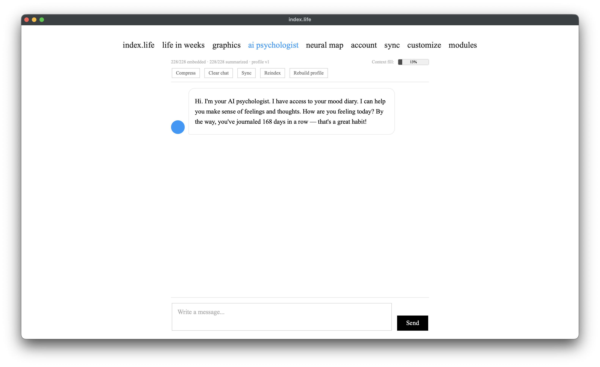

# AI Psychologist

[← back to index](../README.md) · [Русский](../ru/ai-psychologist.md)

The AI Psychologist is a chat with a **local** language model that has read access to your diary. It helps you make sense of feelings and thoughts, notices patterns, and can reference specific entries, periods, and people. Everything runs **on your device** — after the model is downloaded, no internet is needed and the conversation never leaves your machine.

> This is **not a replacement for a real therapist** and not a crisis service. See [Limitations](#limitations).

---

## The model

- **Qwen3.5-9B** in **GGUF** format, **Q4_K_M** quantization (~4.7 GB). Downloaded automatically when you install the module.
- Runs via **llama-cpp-python** (CPU or GPU — see [profiles](modules.md#ai-psychologist-gpu-profiles)).
- **Context window:** 4096 tokens by default (overridable via `LLM_N_CTX`). The chat shows a "Context fill" indicator for how much of the window is used.
- **Thinking (reasoning) mode:** a toggle in the chat. When on, the model "thinks" first (you can expand the thought process) and then answers — slower but more considered.

---

## Four-layer memory

So a small local model can "remember" a whole diary that won't fit in context, memory is split into 4 layers:

| Layer | What it holds | How it's used |
|---|---|---|
| **1. Raw** | original `mood_entries` records | the source of truth for every other layer |
| **2. Vector** | entry embeddings (model `intfloat/multilingual-e5-small`) | semantic search: finds entries by meaning, not exact words |
| **3. Summary** | a short summary of each entry + monthly overviews | gives the model a "compressed history" without burning context |
| **4. Profile** | a structured psychological profile (JSON) | stable traits, themes, and patterns accumulated as you write |

Layers 2–4 are built **in the background**: when you save an entry, it's quietly embedded and summarized, and the profile is rebuilt periodically. The same background processing extracts **activities** and **people** from your notes — which the [Graphics](graphics.md) then visualize.

---

## The agent / tool system

The AI psychologist isn't just "the model + your last message." Before composing a reply it runs a small **agent loop** that fetches exactly the diary data the question needs, so answers are grounded in real records instead of guesses.

**How a turn works:**

1. **Routing.** A separate, cheap LLM call (the *router*) reads your message — and your previous message too, so follow-ups like "tell me more" keep their topic — and decides which tools to call, from **none to three**. It replies with a small JSON list of `{tool, args}`. Short or trivial messages skip routing entirely and are answered directly.
2. **Execution.** Each chosen tool runs as a plain, fast database query (no LLM inside, so it's cheap) and returns a compact block of text — dates, ratings, excerpts, aggregates. The chat briefly shows which data is being fetched.
3. **Grounding.** The tool results are appended to the system prompt in a dedicated "extra diary data" section, capped in size so they don't crowd out the rest of the context.
4. **Answer.** Only now does the main model compose the reply, combining the freshly fetched facts with the always-on memory layers (profile, monthly timeline, recent and semantically-relevant entries).

This keeps the model honest. A tool that finds nothing returns an explicit "no entries found" message rather than silence, and the system prompt forbids inventing entries — so on an empty diary, or for a person or period with no records, the model says so plainly instead of making things up.

**Available tools:**

| Tool | What it fetches | Example question |
|---|---|---|
| `person_history` | every entry mentioning one person (name or role), alias-resolved, with a tone breakdown | "What did I write about my mom?" |
| `people_overview` | all people in the diary at once, ranked by mentions, each with a tone score | "Who lifts my mood and who drags it down?" |
| `period_entries` | entries for a period (year required, month optional) | "How did March 2025 go?" |
| `search_topic` | semantic search by theme / feeling / pattern | "What's going on with my anxiety?" |
| `mood_trend` | mood trajectory over the last N days (average, range, direction) | "How have I been lately?" |
| `compare_periods` | headline stats for two periods plus the delta | "Was this month better than last?" |
| `activity_impact` | each activity's average mood vs your overall average (what lifts or drains you) | "What helps me feel better?" |
| `best_worst_days` | the highest- and lowest-rated days, with excerpts | "When was I at my worst?" |
| `diary_stats` | totals, how long you've journaled, current and longest streaks, this month | "How long have I kept this diary?" |
| `on_this_day` | entries from today's date in previous years | "What happened a year ago today?" |

A single question can combine up to **three** tools — e.g. "What did I do with mom in March and how did it affect my mood?" → `person_history` + `period_entries` + `activity_impact`.

**Notes:**

- `activity_impact`, `people_overview`, and the tone in `person_history` rely on the **background extraction** of activities and people from your notes (the same data behind the [Graphics](graphics.md)). Right after new entries, give it a little time to catch up.
- All tools **exclude soft-deleted entries**, so a deleted day is never quoted back to you.
- Each tool is small and self-contained, so the toolset can grow over time.

---

## Chat toolbar

| Button | What it does |
|---|---|
| **Context fill** | indicator of how much of the context window the history uses |
| **Compress** | drops older messages, keeping the latest — frees up context |
| **Clear chat** | erases the whole conversation |
| **Sync** | generates missing embeddings/summaries (if background processing fell behind) |
| **Reindex** | full recompute of embeddings and summaries across all entries |
| **Rebuild profile** | rebuilds the psychological profile (layer 4) |

---

## Capabilities

- Understands your diary's context and references specific entries.
- Finds entries by meaning (semantic search), not just exact words.
- Sees mood dynamics and can compare periods.
- Remembers people and themes recurring in your notes.
- Connects what you do and who you spend time with to how you feel (activities & people).
- Runs offline and privately — nothing is sent to the network.

---

## Limitations

- **Not a therapist and not a crisis service.** In a crisis, reach out to real professionals and helplines. The model is not meant for medical/psychiatric decisions.
- **A small local model** (9B, 4-bit quantization) can be wrong, invent details, and oversimplify. Verify anything important.
- **Limited context** (~4096 tokens): in a single answer the model doesn't see the entire diary verbatim, but a compressed digest via the memory layers and tools.
- **Quality scales with how much you write** — the more and the more regularly you journal, the more useful the answers and the more accurate the profile.
- On CPU answers are slow (~3–5 tokens/s); a GPU profile is needed for comfortable speed.

---

## System requirements

| Profile | What you need |
|---|---|
| **CPU** | ~16 GB RAM, any modern processor. Slow but works everywhere |
| **NVIDIA (cuda)** | GPU 8 GB+ VRAM, driver 452.39+ |
| **Any GPU (vulkan)** | GPU with Vulkan support (NVIDIA/AMD/Intel), 8 GB+ VRAM |
| **Apple Silicon (metal)** | M1/M2/M3/M4 Mac with 16 GB+ unified memory (8 GB is not enough) |
| **Disk** | ~5 GB for the GGUF model + space for the Python environment |
| **Network** | only for the one-time model + package download; offline afterward |

For profile choice and install, see [Module system](modules.md).

> **For maintainers.** Pre-built Vulkan GPU wheels download from the GitHub release tagged `VULKAN_WHEEL_TAG` (`tools/install_modules.py`). If you re-create releases/tags, make sure the release with that tag contains the wheels (`llama_cpp_python-*-win_amd64.whl` and `*-linux_x86_64.whl`), otherwise GPU-profile install breaks. The wheels are rebuilt by the workflow on every release.
