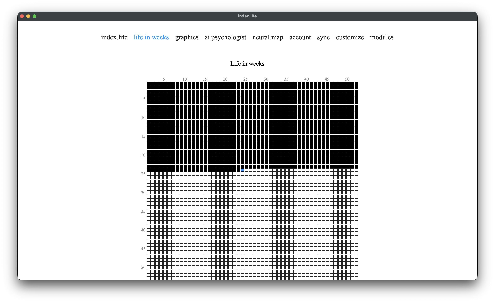
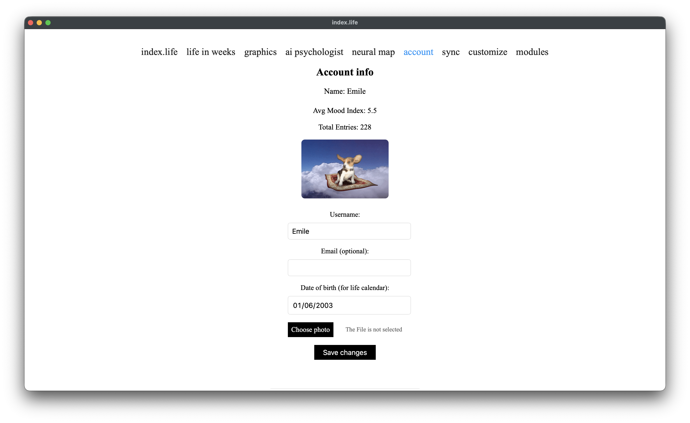

# The application

[← back to index](../README.md) · [Русский](../ru/application.md)

index.life is a local mood diary. Each day you give a rating (1–10) and write a note; the app helps you remember and become aware of your time. Everything runs **fully offline** — no accounts, passwords, or clouds by default.

---

## What the app is made of

- **Backend:** Flask 3 (Python). A local web server on `127.0.0.1:5001`.
- **Database:** SQLite (via Flask-SQLAlchemy), WAL mode.
- **Frontend:** HTML + CSS + vanilla JavaScript. The note editor is Tiptap (a WYSIWYG layer over Markdown).
- **App window:** a native window via pywebview (WKWebView on macOS, WebView2 on Windows). If pywebview isn't available it falls back to your default browser.
- **Modules:** optional features (AI psychologist, neural map, customization, graphics) you enable on demand. See [Module system](modules.md).

On launch, `run.py` starts Flask in a background thread and opens the native window. In parallel it runs: DB schema migrations, a backup, an update check, and (if configured) sync.

---

## Where your data is stored

The app picks a data directory based on platform and how it was launched:

| Platform / launch | Data directory |
|---|---|
| Run from source (any OS) | the project folder (next to `run.py`) |
| **Windows** (built .exe) | **next to the .exe** (portable). Legacy users: `%APPDATA%\index.life` |
| **macOS** (.app) | `~/Library/Application Support/index.life` |
| **Linux** (AppImage) | `~/.index-life` |

> **Windows is portable:** data lives next to the program, so you can keep the whole app on any drive/USB and move it as one folder. If you have data in `%APPDATA%` from an old version, the app detects it via markers (`diary.db`, `modules_venv`, `models`, `profile_photos`) and keeps using it.

Inside the data directory:

| Item | What it is |
|---|---|
| `diary.db` | The main database: entries, profile, chat, sync metadata |
| `diary.db-wal`, `diary.db-shm` | WAL helper files (don't delete) |
| `profile_photos/` | Uploaded profile photo |
| `backups/` | Automatic database backups (see below) |
| `backups/pre-sync/` | Separate pool of backups taken before each sync |
| `modules_venv/` | Python environment for modules (created when you install modules) |
| `models/` | Downloaded AI models (GGUF, embeddings, etc.) |
| `customization_uploads/` | Images and fonts for customization |
| `*_enabled` | Marker files for enabled modules (`graphics_enabled`, `assistant_enabled`, …) |

**Manual backup** — just copy `diary.db` (for safety with the app closed, include `-wal`/`-shm`, or copy after a clean exit).

---

## The database

SQLite in **WAL** (Write-Ahead Logging) mode — this gives reliability under concurrent reads/writes and the background processing that runs alongside. Each connection waits up to 30 seconds for a lock.

The schema is versioned: migrations run on startup (current schema version is 7), so updating the app never breaks an existing database.

Main tables:

| Table | Purpose |
|---|---|
| `mood_entries` | Day entries: date, rating 1–10, note, `uuid`, `device_id`, `deleted` flag |
| `user_profile` | Profile: name, email, birthdate, photo, interface language |
| `chat_messages` | AI psychologist chat history |
| `sync_meta` | Key-value: device_id, sync settings, last-sync time |
| `sync_conflicts` | Sync conflict log (kept 30 days) |
| `entry_summaries`, `period_summaries` | AI memory layer 3: per-entry and monthly summaries |
| `entry_embeddings` | AI memory layer 2: vector representations of entries |
| `user_psych_profile` | AI memory layer 4: structured psychological profile |
| `entry_activities`, `entry_people`, `person_aliases` | Activities and people extracted by the AI (for graphics) |
| `mind_clusters`, `mind_cluster_entries` | Neural-map topics |
| `user_customization` | Appearance settings (JSON) |

Deleting an entry is a **soft delete** (`deleted=True`), not a physical one — so the deletion propagates correctly to other devices on sync and won't "resurrect". Soft-deleted entries are hidden in the UI.

---

## Markdown formatting of notes

The day note is edited in the **Tiptap** WYSIWYG editor but is **stored as plain Markdown** in the `note` field. That keeps your entries readable and portable — openable in any markdown editor or as plain text.

Supported:

| Element | How |
|---|---|
| **Bold** | the **B** button or `Ctrl/Cmd+B` |
| *Italic* | the *I* button or `Ctrl/Cmd+I` |
| Headings H1/H2/H3 | the H1/H2/H3 buttons |
| Bullet list | the "• list" button |
| Numbered list | the "1. list" button |
| Link | the "link" button |
| Quote | the `"` button |
| ~~Strikethrough~~ | `Ctrl/Cmd+Shift+X` |
| `Code` | `Ctrl/Cmd+E` |
| Horizontal rule | the `―` button |

On save the text is normalized: extra blank lines are removed, blank lines between list items collapse, numbered lists are renumbered 1..n, and invisible characters are stripped. This prevents "ragged" markdown.

**Drafts.** While you type, the text is auto-saved to a browser draft (localStorage) — if you accidentally close the page, your text isn't lost. The draft is cleared once the entry is saved.

**Note font.** By default notes render in Times New Roman. In [Customization](customization.md) you can enable "Apply body font to diary notes" so your chosen font also applies to the editor.

---

## App pages

<!-- SCREENSHOT: day editor with a Markdown note | ../../images/edit-day.png -->

| Page | Purpose |
|---|---|
| **index.life** (calendar) | The year as a heatmap grid of cubes: filled days are shaded. Click a day to write/edit |
| **Day entry** | Rating 1–10 via cubes + a markdown note |
| **Life in weeks** | Your whole life as a grid of weeks (from your birthdate) — a motivating view of time |
| **Graphics** | Mood visualizations (module). See [Graphics](graphics.md) |
| **AI Psychologist** | Chat with a local model (module). See [AI Psychologist](ai-psychologist.md) |
| **Neural Map** | A map of your diary's topics (module). See [Neural Map](neural-map.md) |
| **Account** | Name, email, birthdate, photo, **language choice**, Markdown export, year archive |
| **Sync** | Set up moving your diary between devices. See [Sync](sync.md) |
| **Modules** | Install/enable optional modules |
| **Customization** | Appearance (module) |

---

## Interface language

The app is fully bilingual (Russian/English). The language is switched on the **Account** page and applies immediately to the entire interface. The choice is stored in the profile (`user_profile.language`).

---

## Exporting data

- **Export to Markdown** (Account page) — exports all entries as one `.md` file grouped by year and month. In the native window a system "Save as" dialog appears.
- **Raw access** — `diary.db` is standard SQLite; open it with any SQLite tools.

---

## Backups & restore

- An **automatic backup** is created on startup and then once a day. The last 10 copies are kept in `backups/` (rotation).
- A **pre-sync backup** is taken before each merge from other devices, in a separate pool `backups/pre-sync/` (last 5), so frequent syncs don't evict the daily archive.
- Backups use the native SQLite backup API (safe even with the database open) and are verified with `PRAGMA integrity_check`.
- **Restore** — on the Sync page, pick a backup and click "Restore". Restart the app afterward.

---

## Privacy

- All data is **local** to your device. No telemetry, accounts, or servers.
- The only network calls: an update check on GitHub (once at startup) and — only if you set it up — sync to the cloud folder you choose.
- The database is **not encrypted**. Protect your device with a password; for cloud sync, note that the JSON snapshots sit in your cloud folder in plain text.
