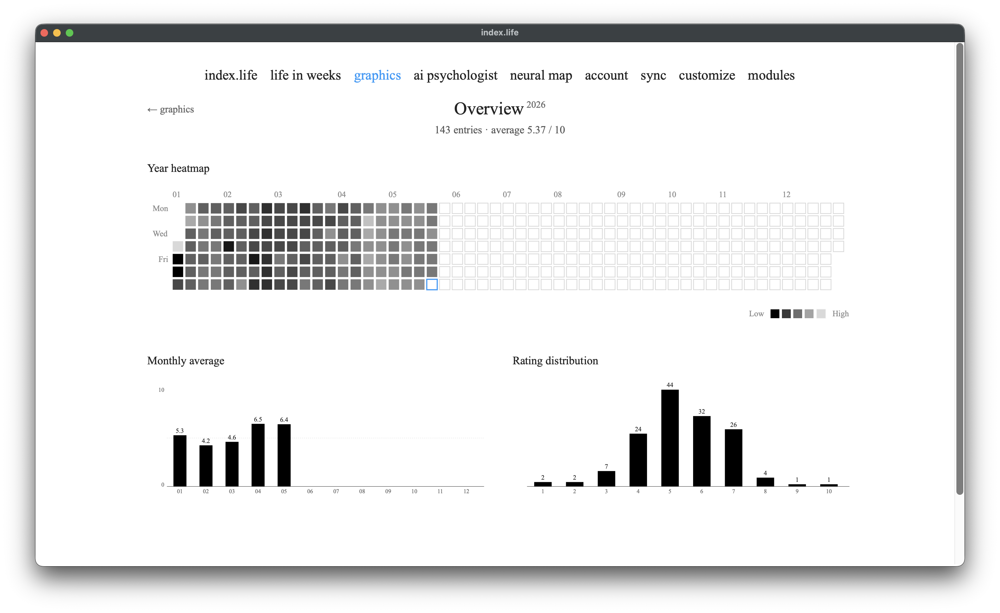
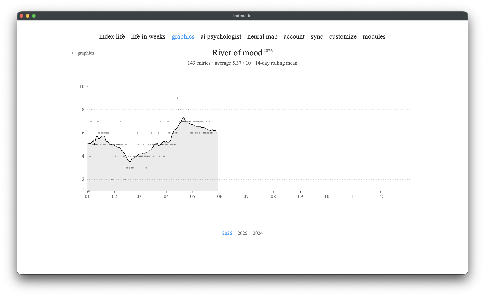
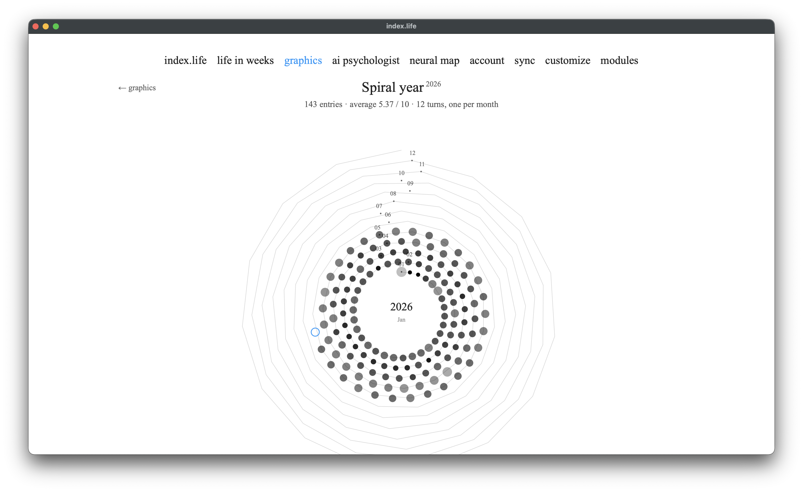
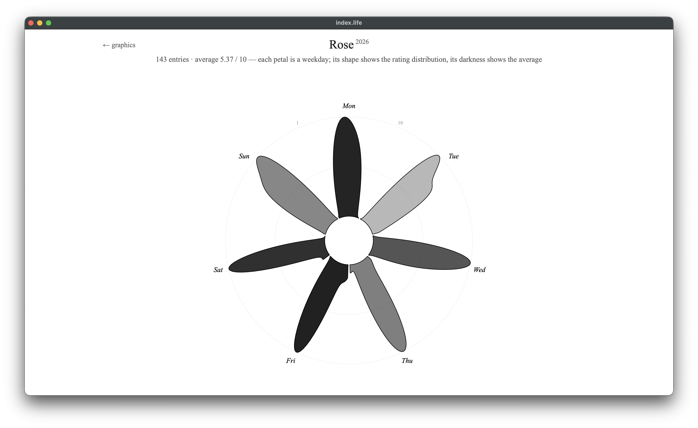
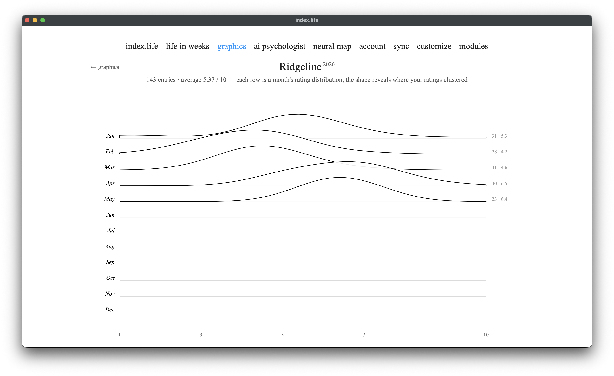
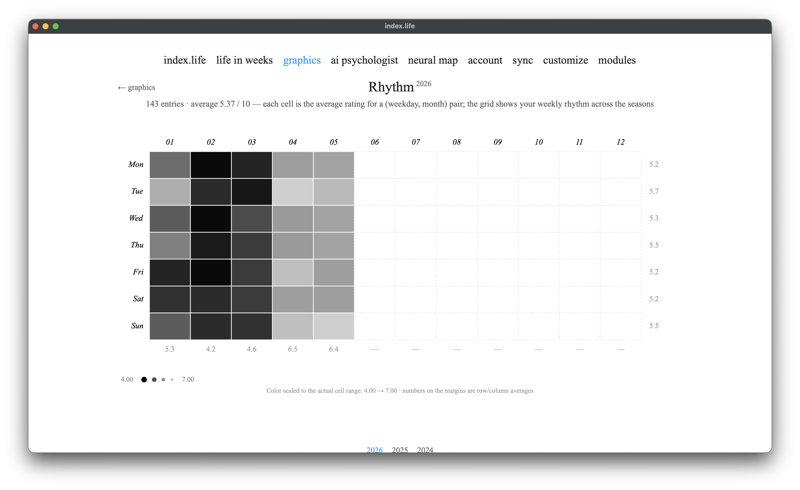
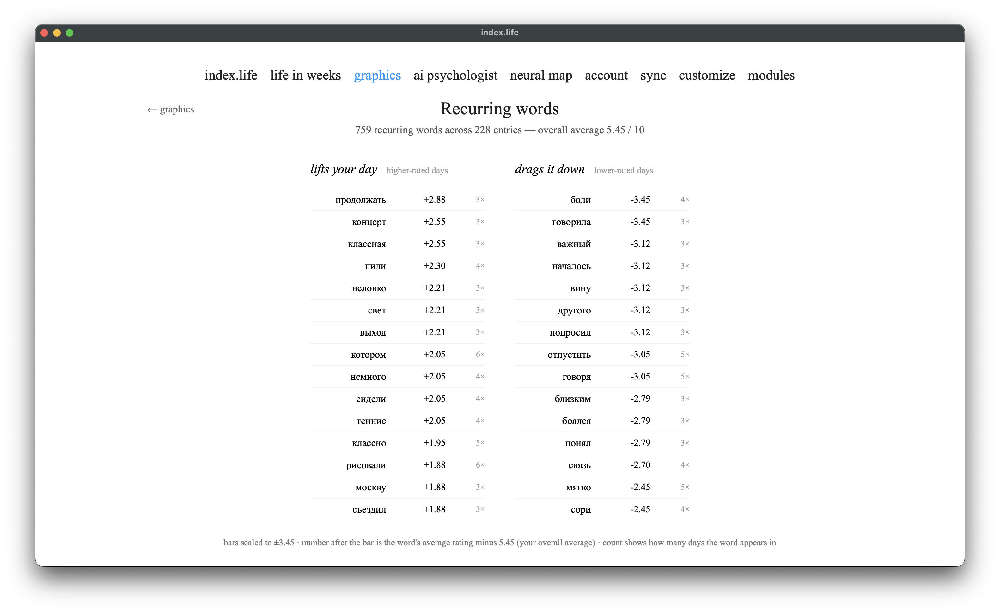
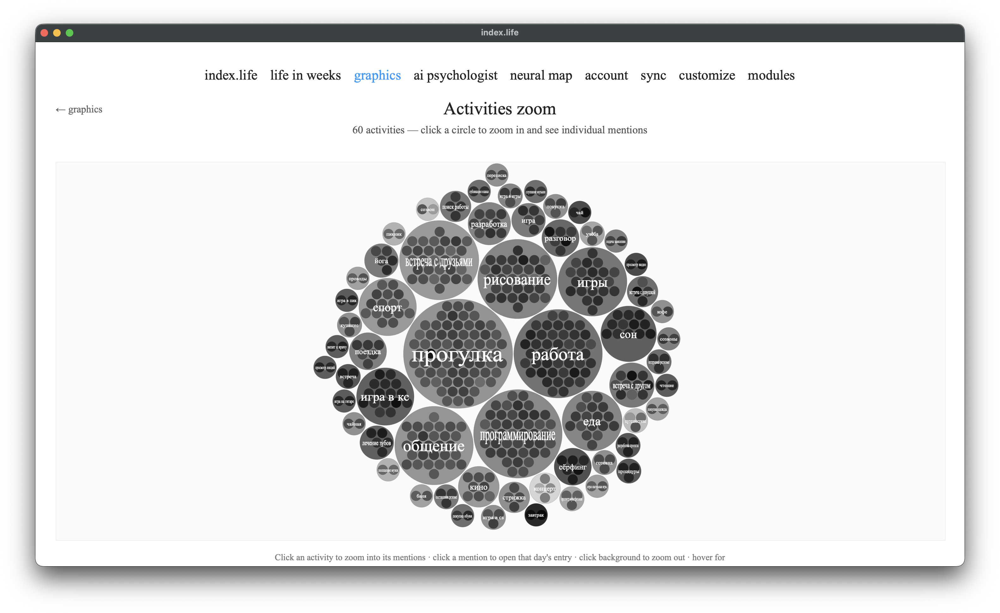

# Graphics

[← back to index](../README.md) · [Русский](../ru/graphics.md)

**Promo video** ([download](../videos/graphics-en.mp4)):

<video src="../videos/graphics-en.mp4" controls width="720"></video>

The Graphics module shows your mood from different angles. Most charts are built straight from daily ratings (1–10); two (**activities** and **people**) require the [AI Psychologist](ai-psychologist.md), which extracts activities and people mentions from your notes.

**Color convention:** almost everywhere color/intensity encodes the rating — darker usually means a lower rating (or a stronger deviation), lighter means higher. Element size usually encodes count.

All chart colors are configurable in [Customization](customization.md) — which also has a live preview of each chart.

---

## Overview

The whole year as one **heatmap grid**: each cell is a day shaded by mood rating. Alongside it: **monthly averages** (bars) and the **rating distribution** (how many days at each rating 1–10).

How to read it: you instantly see the "temperature" of the year — dark streaks are dips, light ones are highs; empty cells are days with no entry. A condensed annual summary on one screen.

---

## River of mood

Mood as a **flowing line across the year**. The smooth curve is a 14-day rolling average (it smooths day-to-day noise); raw daily dots sit beneath it; a vertical marker shows today; a soft fill lies under the curve.

How to read it: the trend over time — where mood is generally heading, where there were sustained ups and downs rather than one-off spikes.

---

## Spiral year

The year **wound onto a spiral**: each day is a dot moving from the center (January) outward to December. The dot's tone encodes mood; concentric guide rings, month markers, and a today highlight complete it.

How to read it: streaks and seasons jump out — whole "turns" (months) being lighter or darker than their neighbors.

---

## Rose (by weekday)

Seven sectors, one per weekday (Monday at the top). **The petal's shape** is the distribution of your ratings on that weekday: a 1→10 scale runs along the sector (the "1" and "10" ticks sit on the Monday petal), and the petal bulges out wherever those ratings happened more often — the widest bulge is your typical rating for that day. Each petal is normalized to its own peak, so they all reach the same outer radius — look at **where** the bulge sits, not at overall size. **Saturation (color)** encodes the weekday's average rating relative to the other days: darker = worse on average, lighter = better (the scale is labeled below the chart).

How to read it: color answers "which weekday tends to be better or worse for me?"; shape shows where your ratings usually land that day and how spread out they are. Hovering a petal shows its entry count and average.

---

## Ridgeline (monthly distributions)

Twelve silhouettes stacked above each other — one per month. Each "ridge" shape is that month's **rating distribution**: the peak is your typical mood that month, the tails are the unusual days.

How to read it: it shows not just the average but the **texture** of a month — whether it was even or a rollercoaster.

---

## Rhythm (weekday × month)

A grid: rows are weekdays, columns are months. Each cell is the **average mood** for that combination (e.g. Mondays in March). The margins show row and column averages; a caption below notes the color scale.

How to read it: it reveals your weekly rhythm across the seasons — exactly which day in which month is systematically better or worse.

---

## Words

Words from your notes **ranked by the mood of the days** they appear on. "Lifts your day" are words tied to your best days; "drags it down" to the worst (a word needs to recur at least a few times).

How to read it: which themes/words statistically accompany your good and bad days.

---

## Activities · requires AI Psychologist

Activities the AI psychologist extracted from your notes, **packed as bubbles**. Bubble size = how often the activity appears; tone = mood relative to your average on those days (lighter = better than average, darker = worse). Click an activity to drill into its individual mentions, hover for the note text, click a mention to open that day.

How to read it: what you do and how it relates to mood — which activities systematically lift you and which drag you down.

---

## People · requires AI Psychologist

<!-- SCREENSHOT: the people chart | ../images/chart-people.png -->

Names and roles the AI psychologist finds in your notes, scored by the **tone of the mentions** (how you write about them, separate from the day's own rating). The tone score ∈ [−1, +1] — the share of positive mentions minus negative. A "Manage names" page lets you merge different forms of one name (aliases).

How to read it: who in your life is associated with lifted mood and who with dips.

---

## Notes

- Charts that need the AI Psychologist (activities, people) fill in as background processing parses your notes — give it a little time after new entries.
- Many charts are per-year — switch the year where year navigation is shown.
- Soft-deleted entries don't appear in the charts.
