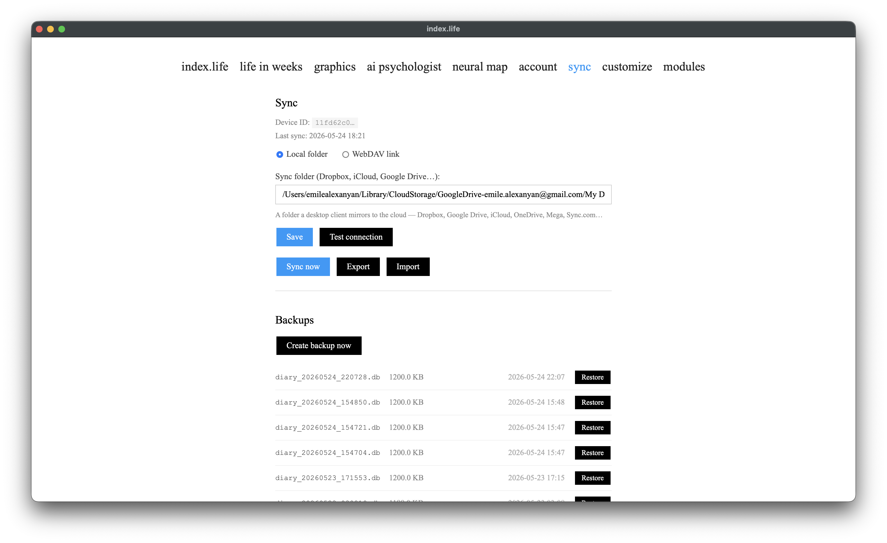

# Sync between devices

[← back to index](../README.md) · [Русский](../ru/sync.md)

Sync moves the current version of your diary between all your devices through shared storage (a cloud folder or a WebDAV server). The app **doesn't talk to any cloud API directly** — it only reads and writes files; distributing them between devices is the chosen service's job.

---

## The idea: one snapshot per device

Each device keeps **exactly one file** in shared storage — `device_<id>.json` — holding its **full state** (all entries including deletion tombstones, chat, profile).

The sync cycle:

1. **Read** every *other* device's snapshot.
2. **Merge** them into the local database.
3. **Rewrite** our own snapshot (atomically).

Why this and not a "change log": with a log, each device must acknowledge receiving each file before it can be deleted. Otherwise a device that sat in a drawer for a week loses those edits permanently. Here the file is **never deleted, only overwritten** — any device that opens the app even a year later reads the current state. And the folder doesn't grow: one file per device.

---

## Safety guarantees

Sync is designed so it **can never wipe your data**:

- **A peer's snapshot is a declaration, not a directive.** Another device's file says "here's what I have", not "here's what should exist everywhere". Merging only **adds** and resolves conflicts by edit time. A peer simply not having an entry **does not mean delete**.
- **Deletion is an explicit tombstone** (`deleted=True`) that replicates correctly. No physical deletes, so an entry never "resurrects" and is always recoverable from a backup.
- **Atomic writes** (`temp file → rename`). A crash mid-write leaves peers the previous valid file, not a fragment. A corrupt/empty file is skipped on read — the local DB is untouched.
- **A backup before every merge** (separate pool `backups/pre-sync/`). If something goes wrong, "Restore" brings the previous state back.
- **Schema validation on import.** An entry missing required fields is skipped, but the rest of the snapshot still applies — one bad item never breaks the whole file.
- **Idempotency.** Re-applying the same snapshot changes nothing.

**Conflict resolution.** If the same date was edited on two devices, the version with the later `updated_at` wins. The losing version is saved to the conflict log (Sync page, kept 30 days) — you can review it and copy it over manually if you want.

---

## Two storage backends

### 1. Local folder

A folder a cloud desktop client mirrors to the internet. Works with **any service that has a desktop client**: Dropbox, Google Drive, iCloud Drive, OneDrive, Mega, Sync.com, etc.

Setup: on the **Sync** page choose "Local folder" and enter the path to the synced folder, e.g.:
```
/Users/you/Dropbox/index-life-sync
C:\Users\you\Google Drive\index-life-sync
```
Point all devices at the **same folder** (inside your cloud).

### 2. WebDAV link

If you'd rather not install a cloud desktop client — paste a direct **WebDAV link** to a folder. Works with **Nextcloud, ownCloud, Yandex.Disk, Box, pCloud, kDrive (Infomaniak)** and any self-hosted WebDAV server.

Setup: choose "WebDAV link" and fill in:
- **Folder URL** — e.g. `https://dav.example.com/remote.php/dav/files/me/diary/`
- **Username and password** — your WebDAV account credentials (e.g. your Nextcloud account, or a Yandex "app password"). Stored locally on this device and only sent to the server you entered.

The **"Test connection"** button checks in advance whether the server is reachable and the credentials are right.

> **What the WebDAV link doesn't cover:** Dropbox, Google Drive, iCloud, OneDrive — these have no open WebDAV (they need OAuth). Use "Local folder" via their desktop client instead.

---

## When sync happens

- On app **startup** (if sync is configured).
- **Periodically** in the background (every ~2 minutes).
- On **saving/deleting an entry** — your snapshot is pushed immediately (best-effort).
- Manually — the **"Sync now"**, **"Export"** (push your snapshot only), and **"Import"** (pull peers only) buttons.

---

## Setting it up from scratch (example)



1. On device A: **Sync** page → choose a mode → enter folder/URL → "Save".
2. Click "Sync now" — `device_<A>.json` appears in storage.
3. On device B: point at the **same** storage → "Sync now". B pulls A's entries and writes its own `device_<B>.json`.
4. From then on it's automatic. Each device sees every other's snapshot.

You can connect any number of devices — the folder will hold one file per device.

---

## Backups

Sync and backups are independent safety mechanisms:

- **Daily backups** of the database — in `backups/` (last 10).
- **Pre-merge backup** — in `backups/pre-sync/` (last 5).
- Restore on the Sync page, then restart the app.

More in [The application → Backups](application.md#backups--restore).

## Connecting your phone (PWA)

The phone client syncs **encrypted only** — the cloud sees nothing but
ciphertext. Connecting takes a couple of minutes:

### Desktop first (recommended)

1. **Desktop.** Sync page → "Find cloud folders" — pick a discovered folder in
   one click (or "Choose folder…"). Save.
2. **Desktop.** Enable end-to-end encryption (passphrase → store the recovery
   key somewhere safe).
3. **Desktop.** In the encryption section open **"Connect your phone"** — a QR
   code appears.
4. **Phone.** Settings → Sync → pick the same cloud (Google Drive /
   Yandex.Disk) → sign in → **"Scan the code from the computer"** → point the
   camera at the QR. No passphrase needed. If the scanner isn't supported
   (iOS Safari), type the code from the desktop screen instead.
5. Check: "Devices in this folder" (both sides) now lists two devices with
   their last-sync times.

### Phone first

1. **Phone.** Settings → Sync → cloud → OAuth → create a passphrase (store the
   recovery key).
2. **Desktop.** Install the same cloud's desktop client and let it mirror.
3. **Desktop.** "Find cloud folders" — the phone's folder is highlighted as
   "sync folder found". Pick it and save.
4. **Desktop.** In the encryption section enter the passphrase — or, on the
   phone, open "Show pairing code" and enter it on the desktop under
   "Enter a pairing code from another device".

### Where the cloud folders live

- **Google Drive** (macOS): `~/Library/CloudStorage/GoogleDrive-<email>/My Drive/index.life`
- **Yandex.Disk**: `<Yandex.Disk folder>/Приложения (Applications)/<app name>/`
- The "Find cloud folders" button scans these locations automatically.

> ⚠️ The pairing code (and its QR) contains the diary's encryption key. Show
> it only to your own devices — never photograph or share it.
