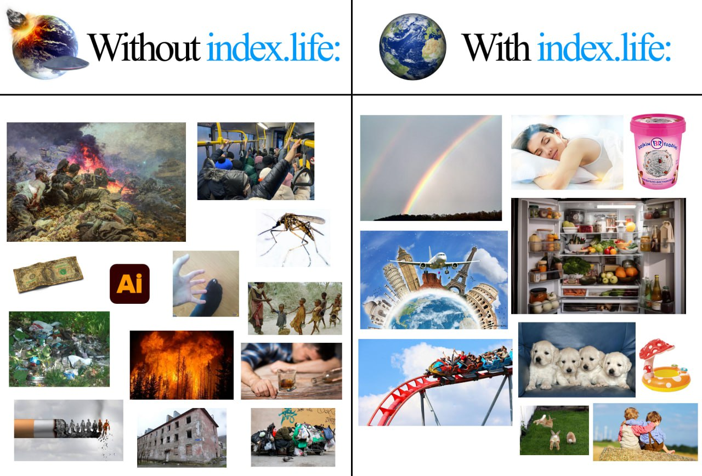
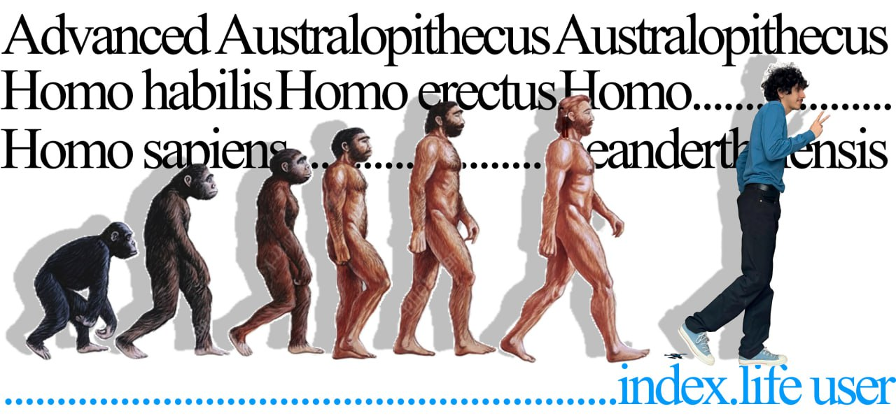

# Memes

A small stash of marketing / community memes for index.life. Open this
file on GitHub and you see every meme inline — no need to download.

## Conventions

- **No `#` in filenames.** It's the URL fragment separator and would
  break ``. Use hyphens: `meme-N.jpg`.
- Keep file sizes reasonable (< ~300 KB ideally). PNG → JPG when an
  image is photographic.
- Numeric suffix is fine for ordering; rename freely as the set grows.

## To reference one anywhere

From a Markdown file under `docs/`:

```markdown

```

From the root README, a GitHub release, an issue, or any external place
(social post, blog) — use the absolute raw URL:

```markdown

```

## Gallery





