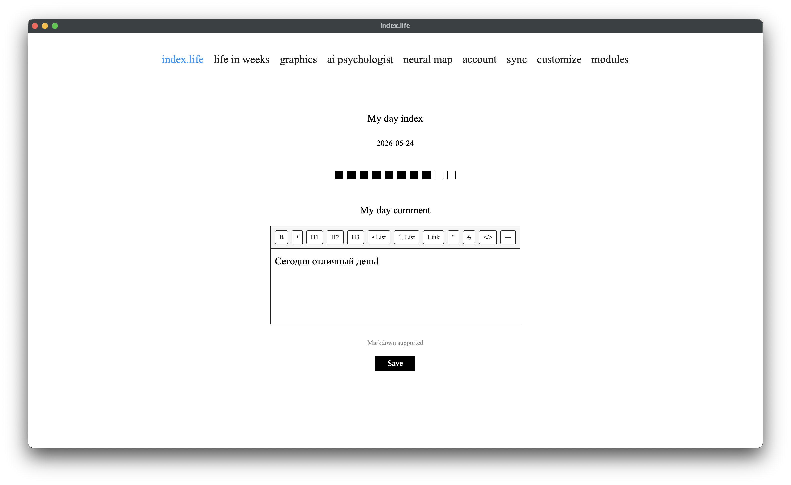

# Приложение

[← к оглавлению](../README.md) · [English](../en/application.md)

index.life — это локальный дневник настроения. Каждый день ты ставишь оценку (1–10) и пишешь заметку; приложение помогает помнить и осознавать своё время. Всё работает **полностью офлайн**, без аккаунтов, паролей и облаков по умолчанию.

---

## Из чего состоит приложение

- **Backend:** Flask 3 (Python). Локальный веб-сервер на `127.0.0.1:5001`.
- **База данных:** SQLite (через Flask-SQLAlchemy), режим WAL.
- **Frontend:** HTML + CSS + ванильный JavaScript. Редактор заметок — Tiptap (WYSIWYG поверх markdown).
- **Окно приложения:** нативное окно через pywebview (WKWebView на macOS, WebView2 на Windows). Если pywebview недоступен — открывается обычный браузер.
- **Модули:** опциональные функции (AI-психолог, нейронная карта, кастомизация, графики), которые подключаются по желанию. См. [Модульная система](modules.md).

При старте `run.py` поднимает Flask в фоновом потоке и открывает нативное окно. Параллельно выполняются: миграции схемы БД, бэкап, проверка обновлений и (если настроена) синхронизация.

---

## Где хранятся данные

Приложение само выбирает каталог данных в зависимости от платформы и способа запуска:

| Платформа / запуск | Каталог данных |
|---|---|
| Запуск из исходников (любая ОС) | папка проекта (рядом с `run.py`) |
| **Windows** (собранное .exe) | **рядом с .exe** (портативно). |
| **macOS** (.app) | `~/Library/Application Support/index.life` |
| **Linux** (AppImage) | `~/.index-life` |

> **Windows портативен:** данные лежат рядом с программой, поэтому можно держать всё приложение на флешке/любом диске и переносить целиком.

Внутри каталога данных:

| Объект | Что это |
|---|---|
| `diary.db` | Главная база: заметки, профиль, чат, метаданные синхронизации |
| `diary.db-wal`, `diary.db-shm` | Служебные файлы режима WAL (не удалять) |
| `profile_photos/` | Загруженное фото профиля |
| `backups/` | Автоматические бэкапы базы (см. ниже) |
| `backups/pre-sync/` | Отдельный пул бэкапов перед каждой синхронизацией |
| `modules_venv/` | Python-окружение для модулей (создаётся при установке модулей) |
| `models/` | Скачанные AI-модели (GGUF, эмбеддинги и т.д.) |
| `customization_uploads/` | Картинки и шрифты для кастомизации |
| `*_enabled` | Файлы-маркеры включённых модулей (`graphics_enabled`, `assistant_enabled`, …) |

**Бэкап вручную** — достаточно скопировать `diary.db` (для надёжности при закрытом приложении — вместе с `-wal`/`-shm`, либо после корректного выхода).

---

## База данных

SQLite в режиме **WAL** (Write-Ahead Logging) — это даёт надёжность при одновременном чтении/записи и параллельной фоновой обработке. На каждом подключении выставляется таймаут ожидания блокировки 30 секунд.

Схема версионируется: при запуске применяются миграции (текущая версия схемы — 7), так что обновление приложения не ломает существующую базу.

Основные таблицы:

| Таблица | Назначение |
|---|---|
| `mood_entries` | Записи дня: дата, оценка 1–10, заметка, `uuid`, `device_id`, флаг `deleted` |
| `user_profile` | Профиль: имя, email, дата рождения, фото, язык интерфейса |
| `chat_messages` | История чата с AI-психологом |
| `sync_meta` | Ключ-значение: device_id, настройки синхронизации, время последней синхронизации |
| `sync_conflicts` | Журнал конфликтов синхронизации (хранится 30 дней) |
| `entry_summaries`, `period_summaries` | Слой 3 памяти AI: краткие сводки записей и месяцев |
| `entry_embeddings` | Слой 2 памяти AI: векторные представления записей |
| `user_psych_profile` | Слой 4 памяти AI: структурированный психологический профиль |
| `entry_activities`, `entry_people`, `person_aliases` | Активности и люди, извлечённые AI (для графиков) |
| `mind_clusters`, `mind_cluster_entries` | Темы нейронной карты |
| `user_customization` | Настройки внешнего вида (JSON) |

Удаление записи — **мягкое** (`deleted=True`), а не физическое: так удаление корректно доезжает до других устройств при синхронизации и не «воскресает». В интерфейсе мягко-удалённые записи скрыты.

---

## Markdown-форматирование заметок

Заметка дня редактируется в WYSIWYG-редакторе **Tiptap**, но **хранится как обычный Markdown-текст** в поле `note`. Это значит, что твои записи остаются читаемыми и портируемыми — их можно открыть в любом markdown-редакторе или просто как текст.

Поддерживается:

| Элемент | Как получить |
|---|---|
| **Жирный** | кнопка **B** или `Ctrl/Cmd+B` |
| *Курсив* | кнопка *I* или `Ctrl/Cmd+I` |
| Заголовки H1/H2/H3 | кнопки H1/H2/H3 |
| Маркированный список | кнопка «• список» |
| Нумерованный список | кнопка «1. список» |
| Ссылка | кнопка «ссылка» |
| Цитата | кнопка `"` |
| ~~Зачёркнутый~~ | `Ctrl/Cmd+Shift+S` |
| `Код` | `Ctrl/Cmd+E` |
| Горизонтальная линия | кнопка `―` |

При сохранении текст нормализуется: убираются лишние пустые строки, схлопываются переносы между пунктами списков, нумерованные списки перенумеровываются 1..n, чистятся невидимые символы. Это исключает «рваный» markdown.

**Черновики.** Пока ты печатаешь, текст автоматически сохраняется в черновик в браузере (localStorage) — если случайно закрыть страницу, набранное не потеряется. После сохранения записи черновик очищается.

**Шрифт заметок.** По умолчанию заметки отображаются шрифтом Times New Roman. В разделе [Кастомизация](customization.md) можно включить опцию «Применить основной шрифт к заметкам», и тогда выбранный шрифт применится и к редактору.

---

## Страницы приложения

| Страница | Назначение |
|---|---|
| **index.life** (календарь) | Год как heatmap-сетка кубиков: заполненные дни закрашены. Клик по дню — запись/редактирование |
| **Запись дня** | Оценка 1–10 кубиками + markdown-заметка |
| **Жизнь в неделях** | Вся жизнь сеткой недель (по дате рождения) — мотивирующий взгляд на время |
| **Графики** | Визуализации настроения (модуль). См. [Графики](graphics.md) |
| **AI-психолог** | Чат с локальной моделью (модуль). См. [AI-психолог](ai-psychologist.md) |
| **Нейронная карта** | Карта тем дневника (модуль). См. [Нейронная карта](neural-map.md) |
| **Аккаунт** | Имя, email, дата рождения, фото, **выбор языка**, экспорт в Markdown, архив по годам |
| **Синхронизация** | Настройка переноса дневника между устройствами. См. [Синхронизация](sync.md) |
| **Модули** | Установка/включение опциональных модулей |
| **Кастомизация** | Внешний вид (модуль) |

---

## Язык интерфейса

Приложение полностью двуязычное (русский/английский). Язык переключается на странице **Аккаунт** и сразу применяется ко всему интерфейсу. Выбор хранится в профиле (`user_profile.language`).

---

## Экспорт данных

- **Экспорт в Markdown** (страница Аккаунт) — выгружает все записи одним `.md`-файлом, сгруппированным по годам и месяцам. В нативном окне открывается системный диалог «Сохранить как».
- **Сырой доступ** — `diary.db` это стандартный SQLite, его можно открыть любыми SQLite-инструментами.

---

## Бэкапы и восстановление

- **Автоматический бэкап** создаётся при старте приложения и затем раз в сутки. Хранятся последние 10 копий в `backups/` (ротация).
- **Бэкап перед синхронизацией** делается перед каждым слиянием с других устройств — в отдельном пуле `backups/pre-sync/` (последние 5), чтобы частые синхронизации не вытесняли суточный архив.
- Бэкапы создаются через нативный SQLite backup API (безопасно даже при открытой базе) и проверяются `PRAGMA integrity_check`.
- **Восстановление** — на странице Синхронизация выбери бэкап и нажми «Восстановить». После восстановления приложение нужно перезапустить.

---

## Приватность

- Все данные — **локально** на твоём устройстве. Никакой телеметрии, аккаунтов, серверов.
- Единственные сетевые обращения: проверка новой версии на GitHub (раз при старте) и — если ты сам настроишь — синхронизация в выбранное тобой облако.
- База **не зашифрована**. Защити устройство паролем; для синхронизации через облако учитывай, что JSON-снимки лежат в твоей облачной папке в открытом виде.
