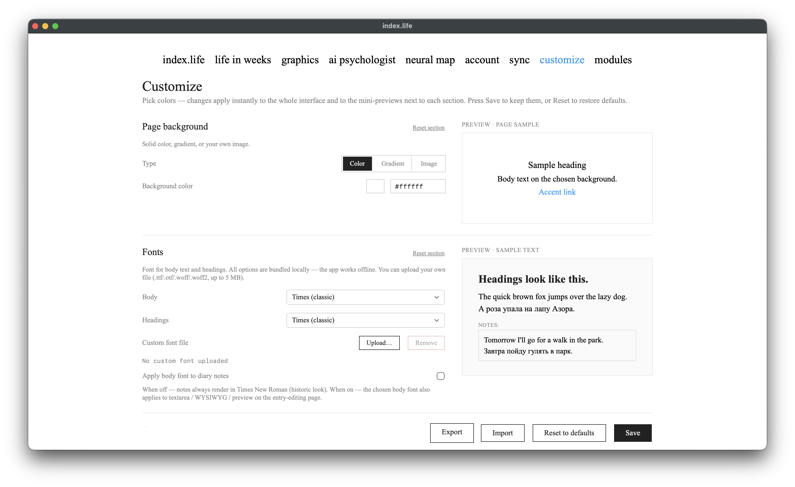
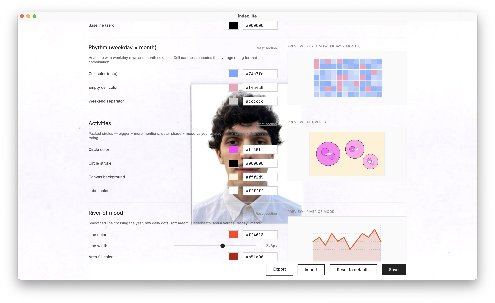

# Кастомизация

[← к оглавлению](../README.md) · [English](../en/customization.md)

Модуль «Кастомизация» меняет внешний вид приложения. Изменения применяются мгновенно ко всему интерфейсу и к мини-превью справа от каждой секции. Кнопки **«Сохранить»** и **«Сбросить»** (есть и сброс отдельной секции).

Технически: настройки хранятся как JSON в `user_customization`, а приложение отдаёт их на каждой странице инлайновым `<style>`-блоком с CSS-переменными — поэтому изменения не зависят от кэша браузера и видны сразу.

---

## Что можно настроить

- **Фон страницы** — сплошной цвет, градиент или своя картинка (с размытием и прозрачностью). Применяется мгновенно для всех трёх типов.
- **Шрифты** — отдельно для текста и заголовков. Все шрифты встроены локально (приложение работает офлайн); можно загрузить свой файл `.ttf/.otf/.woff/.woff2` (до 5 МБ). Опция «Применить основной шрифт к заметкам» распространяет шрифт на редактор заметки.
- **Текст и акцент** — основной цвет текста, приглушённый (вторичный) текст, цвет заголовков, акцент (активная ссылка).
- **Авто-инверсия текста** — пересчитывает цвет текста под яркость фона, чтобы он оставался читаемым на тёмном фоне.
- **Календарь** — цвета кубиков: заполненный день, пустой день, граница, подсветка «сегодня».
- **Календарь-мозаика** — «расстелить» картинку по всему календарю: каждый куб — окно в свой кусочек. Пустые дни могут показывать цвет, градиент или вторую картинку, которая «проявляется» по мере заполнения дней.
- **Графики** — общий цвет для всех графиков плюс **отдельная настройка каждого графика** (своя подсекция с живым превью): река, спираль, роза, хребты, ритм, обзор, активности.
- **Нейронная карта** — цвета нейронов, активного нейрона, связей и фона холста.

---

## Очистка хранилища

Загруженные картинки и шрифты лежат в `customization_uploads/`. Если ты экспериментировал с разными фонами — старые файлы остаются на диске. В конце страницы есть «Очистка хранилища»: показывает «осиротевшие» файлы (на которые больше нет ссылок) и удаляет их по подтверждению.

---

## Экспорт/импорт темы

Тему можно выгрузить в JSON-файл и загрузить обратно (кнопки «Экспорт»/«Импорт») — удобно переносить оформление между устройствами или делиться. При импорте значения проверяются теми же валидаторами, что и при сохранении, так что некорректный файл не «протащит» плохие стили.
