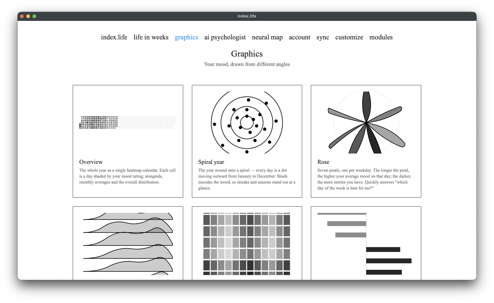

# Графики

[← к оглавлению](../README.md) · [English](../en/graphics.md)

Модуль «Графики» показывает твоё настроение под разными углами. Большинство графиков строятся прямо из оценок дня (1–10); два (**активности** и **люди**) требуют [AI-психолога](ai-psychologist.md), который извлекает из заметок активности и упоминания людей.

**Общая логика цвета:** почти везде цвет/насыщенность кодирует оценку — темнее обычно значит ниже оценка (или сильнее отклонение), светлее — выше. Размер элемента, как правило, кодирует количество.

Все цвета графиков настраиваются в [Кастомизации](customization.md) — там же есть живое превью каждого графика.

---

## Обзор (overview)

<!-- SCREENSHOT: график «overview» | ../../images/chart-overview.png -->

Весь год одной **heatmap-сеткой**: каждая клетка — день, окрашенный по оценке настроения. Рядом — **месячные средние** (столбики) и **распределение оценок** (сколько дней на каждую оценку 1–10).

Как читать: сразу видно «температуру» года — тёмные полосы это просадки, светлые — подъёмы; пустые клетки — дни без записи. Сжатая годовая сводка на одном экране.

---

## Река настроения (river of mood)

<!-- SCREENSHOT: график «river» | ../../images/chart-river.png -->

Настроение как **плавная линия по году**. Гладкая кривая — это 14-дневное скользящее среднее (сглаживает шумday-to-day); под ней точками — реальные дневные оценки; вертикальная отметка — сегодня; мягкая заливка под кривой.

Как читать: тренд во времени — куда в целом движется настроение, где были устойчивые подъёмы и спады, а не разовые всплески.

---

## Спираль года (spiral year)

<!-- SCREENSHOT: график «spiral» | ../../images/chart-spiral.png -->

Год, **намотанный на спираль**: каждый день — точка, идущая от центра (январь) наружу к декабрю. Тон точки кодирует настроение; концентрические кольца-направляющие, метки месяцев и подсветка сегодняшнего дня.

Как читать: полосы и сезоны видны сразу — целые «витки» (месяцы) светлее или темнее, чем соседние.

---

## Роза (по дням недели) (rose)

<!-- SCREENSHOT: график «rose» | ../../images/chart-rose.png -->

Семь лепестков — по одному на день недели. **Длина лепестка** = среднее настроение этого дня недели; **насыщенность** = сколько у тебя записей в этот день. Под графиком — легенда диапазона и пояснение масштаба.

Как читать: быстрый ответ на вопрос «какой день недели для меня лучший/худший?». Понедельники против суббот наглядно.

---

## Хребты (месячные распределения) (ridgeline)

<!-- SCREENSHOT: график «ridgeline» | ../../images/chart-ridgeline.png -->

Двенадцать силуэтов друг над другом — по одному на месяц. Форма каждого «хребта» — это **распределение оценок** этого месяца: где пик — твоё типичное настроение в месяце, хвосты — необычные дни.

Как читать: показывает не только среднее, но и **фактуру** месяца — был ли он ровным или «качельным».

---

## Ритм (день недели × месяц) (rhythm)

<!-- SCREENSHOT: график «rhythm» | ../../images/chart-rhythm.png -->

Сетка: строки — дни недели, столбцы — месяцы. Каждая клетка — **среднее настроение** для этой комбинации (например, понедельники в марте). На полях — средние по строкам и столбцам; снизу подпись о масштабе цвета.

Как читать: раскрывает недельный ритм по сезонам — где именно (какой день в каком месяце) систематически лучше или хуже.

---

## Слова (words)

<!-- SCREENSHOT: график «words» | ../../images/chart-words.png -->

Слова из твоих заметок, **отранжированные по настроению дней**, в которых они встречаются. «Поднимают день» — слова, связанные с лучшими днями; «тянут вниз» — с худшими (нужно, чтобы слово повторялось хотя бы несколько раз).

Как читать: какие темы/слова статистически сопровождают твои хорошие и плохие дни.

---

## Активности (activities) · нужен AI-психолог

<!-- SCREENSHOT: график «activities» | ../../images/chart-activities.png -->

Активности, которые AI-психолог извлёк из заметок, **упакованы как пузыри**. Размер пузыря = как часто активность встречается; тон = настроение относительно твоего среднего в эти дни (светлее = лучше среднего, темнее = хуже). Клик по активности раскрывает её отдельные упоминания, наведение — текст заметки, клик по упоминанию — открыть тот день.

Как читать: что ты делаешь и как это связано с настроением — какие занятия систематически поднимают, а какие тянут вниз.

---

## Люди (people) · нужен AI-психолог

<!-- SCREENSHOT: график «people» | ../../images/chart-people.png -->

Имена и роли, которые AI-психолог находит в заметках, оценённые по **тональности упоминаний** (как ты о них пишешь, отдельно от оценки самого дня). Шкала тональности ∈ [−1, +1] — доля позитивных упоминаний минус негативных. Есть страница «Управление именами» — там можно объединить разные формы одного имени (алиасы).

Как читать: кто в твоей жизни связан с подъёмом настроения, а кто — со спадом.

---

## Замечания

- Графики, требующие AI-психолога (активности, люди), наполняются по мере того, как фоновая обработка разбирает заметки — после новых записей дай ей немного времени.
- Многие графики годовые — переключай год там, где есть навигация по годам.
- Удалённые (мягко) записи в графики не попадают.
