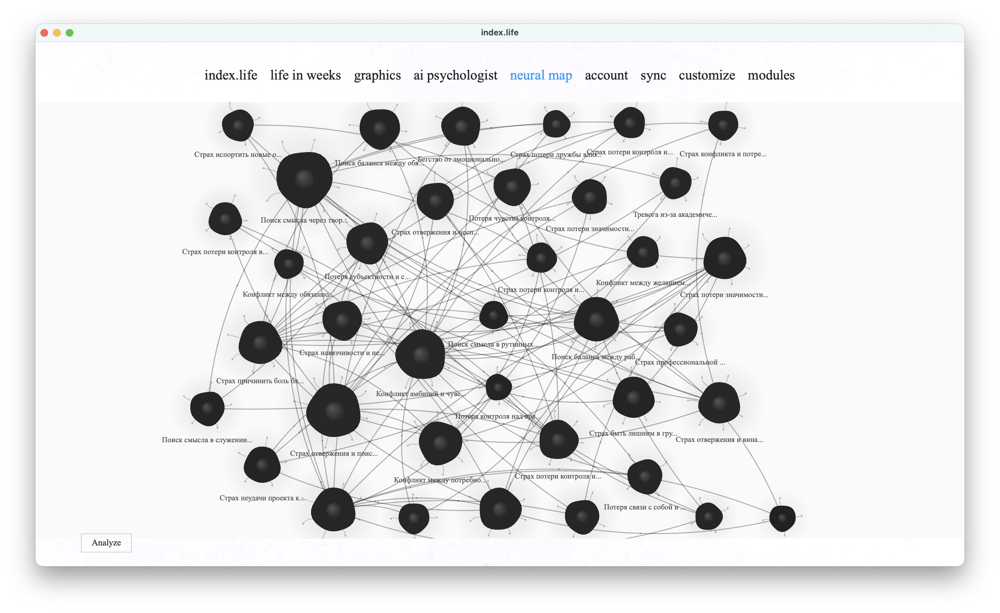

# Нейронная карта

[← к оглавлению](../README.md) · [English](../en/neural-map.md)

Нейронная карта превращает твой дневник в **карту тем**: повторяющиеся сюжеты, переживания и сферы жизни группируются в «нейроны», связанные между собой. Это взгляд сверху на то, о чём ты пишешь и какие темы эмоционально весомее.

> Модуль требует установленного [AI-психолога](ai-psychologist.md): он использует те же эмбеддинги (слой 2 памяти) и ту же модель для названий тем.

---

## Как строится карта

Идея простая: взять все записи, понять, какие из них «про одно и то же», собрать их в темы и нарисовать каждую тему отдельным нейроном. Карта пересобирается кнопкой **«Проанализировать»** (а также автоматически в фоне после новых записей).

По шагам:

1. **Записи превращаются в числа (эмбеддинги).** Каждая запись прогоняется через модель `intfloat/multilingual-e5-small`, которая переводит её текст в вектор — набор чисел, отражающий смысл. Записи о похожем оказываются рядом в этом пространстве.
2. **Похожее группируется (кластеризация).** Алгоритм ищет плотные «сгустки» близких записей и делает из каждого отдельную тему:
   - меньше 6 записей → одна общая тема (группировать ещё нечего);
   - от 6 записей → **HDBSCAN** — находит сгустки любой формы и сам определяет их количество; если он не установлен, берётся запасной метод (`AgglomerativeClustering`).
3. **«Потерявшиеся» записи пристраиваются.** Одиночки, которые алгоритм счёл шумом, дописываются к ближайшей подходящей теме, если достаточно близки; из остального собираются мелкие, но связные темы — чтобы редкое не пропадало.
4. **Темы получают названия.** Для каждой темы локальная модель (та же, что у AI-психолога) читает несколько характерных записей и придумывает короткое название и описание, а также оценивает эмоциональный вес темы (его видно в панели темы).
5. **Сохранение.** Темы записываются в базу; темы из слишком малого числа записей (по умолчанию меньше 2) скрываются как недостаточно подтверждённые.

Каждый запуск «Проанализировать» собирает карту заново — поэтому со временем, по мере записей, темы уточняются.

---

## Что показывает карта

- **Нейрон** — это тема. **Размер нейрона** = сколько записей в неё попало: чем больше записей, тем крупнее нейрон. Это единственный визуальный признак «веса» темы на карте.
- **Цвет** у всех нейронов одинаковый (его можно сменить в [Кастомизации](customization.md)) — цвет не кодирует тему. Размер нейрона слегка «пульсирует» в зависимости от эмоционального веса, но на глаз это почти незаметно.
- **Связи (линии)** соединяют каждую тему с **самыми близкими** к ней по смыслу темами — по умолчанию с 3 ближайшими на нейрон. (Простой порог по сходству тут не работает: модель эмбеддингов считает почти любые две дневниковые темы довольно похожими, поэтому любой фиксированный порог связал бы «все со всеми»; вместо этого берутся несколько ближайших соседей каждого нейрона — так остаются только реальные родственные связи.)

**Панель темы** (клик по нейрону) показывает: название, описание, число записей, эмоциональный вес, опорные цитаты-доказательства и сами записи. Если данных в теме мало, панель помечается как «низкая достоверность».

**Кнопки:**
- **Проанализировать** — пересобрать карту по текущим записям.
- **Обсудить с психологом** (если включён AI-психолог) — открыть чат, уже настроенный на обсуждение выбранной темы.

---

## Цвета

Цвета нейронов, связей и фона холста настраиваются в [Кастомизации](customization.md) (секция «Нейронная карта»).

---

## Ограничения

- Нужны накопленные записи: на нескольких заметках карта будет бедной или из одной темы.
- Названия тем генерирует маленькая локальная модель — иногда они приблизительные; перезапусти «Проанализировать» после новых записей, чтобы карта стала точнее.
- Кластеризация эвристична: одна и та же тема может разбиться на две или наоборот слиться — это нормально для плотностных методов на небольших данных.
